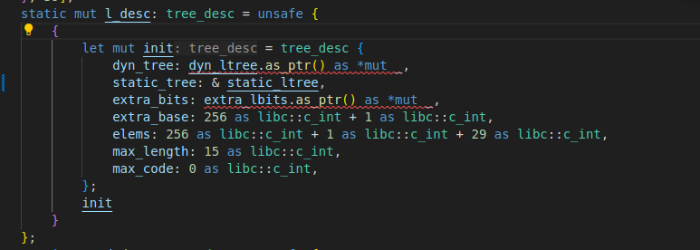
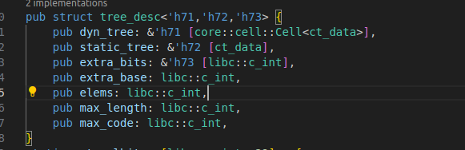
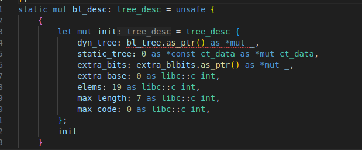
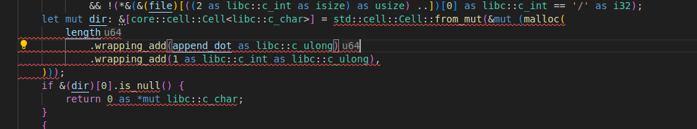

1. Mismatched type errors

fig1: code snippet in trees.rs, lines 153-166

fig2: code snippet in trees.rs, lines 40-48

types of some fields of 'struct tree_desc' are converted from '\*const ct_data' or '\*mut ct_data' to '&[ct_data]' or '&[core::cell::Cell<ct_data>]' by the refactoring tool, and 'dyn_ltree', 'static_ltree', 'extra_lbits' are some static data of the type '[ct_data]'.

fig1 shows an example of occurrence of  mismatched type error,where the initialization of the field 'static_tree' and 'extra_bits' are easy to handle: just like '& static_ltree', which is already fixed by me. It'd be more tricky to fix 'dyn_tree', since the type of the field is '& [cell::Cell<ct_data>]' to enable interior mutability, while 'dyn_ltree', the variable used to initialize 'dyn_tree' field, is of the type '[ct_data]'. Therefore, I need to modify the type of 'dyn_ltree' to '[cell::Cell<ct_data>]' and all the access to it.

2. Potential Null raw pointer

Another problem arises from potential Null raw pointer. fig3 shows the case where 'static_tree' field is directly initialized as null pointer. In order to keep behaviors and remove raw pointer, I should wrap 'dyn_tree', 'static_tree', and 'extra_bits' fields with 'Option'.

fig3: code snippet in trees.rs, lines 181-194

3. Malloc

The return type of 'libc::malloc' function is '*mut libc::c_void'. I guess that the refactoring tool tried to eliminate raw pointer return types of functions, and as a result, there're codes that require conversion from the value returned by 'libc::malloc' to safe reference of array like '&[core::cell::Cell<t>]'. I'm currently not sure how to do that.

fig4: code snippet in dirname_lgpl.rs, lines 61-65